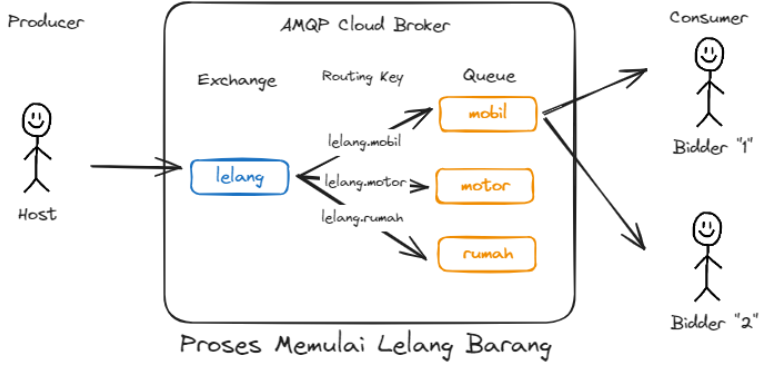

# Python Auction System with Tkinter and RabbitMQ



This Python Auction System is built using Tkinter for the graphical user interface (GUI) and RabbitMQ as the messaging protocol. It provides a platform for conducting auctions where users can bid on items.

## Features

- **User Registration**: Users can register to participate in auctions.
- **Item Listing**: Sellers can list items for auction.
- **Bidding System**: Registered users can place bids on listed items.
- **Real-time Updates**: Updates on bids and auction status are displayed in real-time.
- **Admin Panel**: Admins can manage users, items, and auctions.

## Dependencies

- Python 3.x
- Tkinter
- RabbitMQ

## Setup Instructions

1. Clone the repository:

    ```bash
    git clone https://github.com/your_username/auction_system.git
    cd auction_system
    ```

2. Install dependencies:

    ```bash
    pip install -r requirements.txt
    ```

3. Set up RabbitMQ:

    - Install RabbitMQ server on your machine.
    - Ensure the RabbitMQ server is running.

4. Run the application:

    ```bash
    python main.py
    ```

5. Access the application:

    Open your web browser and go to `http://localhost:5000`.

## Usage

- **Registration**: Users need to register before participating in auctions.
- **Login**: Registered users can log in using their credentials.
- **Auction Listings**: Sellers can list items for auction, specifying details such as starting price, auction duration, etc.
- **Bidding**: Users can view listed items and place bids on them.
- **Admin Control**: Admins have access to an admin panel where they can manage users, items, and auctions.

## Project Presentation

For more details about the project, please refer to the [project presentation](https://www.canva.com/design/DAFz7l_U8ik/5wH6cAlGK-QU0QMeTr3I6A/edit?utm_content=DAFz7l_U8ik&utm_campaign=designshare&utm_medium=link2&utm_source=sharebutton).


